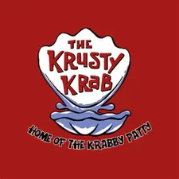

<a name="readme-top"></a>

<div align="center">
  
  <br/>

  <h3><b>Quotes</b></h3>

</div>

<!-- TABLE OF CONTENTS -->

# 📗 Table of Contents

- [📖 About the Project](#about-project)
  - [🛠 Built With](#built-with)
    - [Tech Stack](#tech-stack)
    - [Key Features](#key-features)
  - [🚀 Live Demo](#live-demo)
- [💻 Getting Started](#getting-started)
  - [Setup](#setup)
  - [Prerequisites](#prerequisites)
  - [Install](#install)
  - [Usage](#usage)
  - [Run tests](#run-tests)
  - [Deployment](#deployment)
- [👥 Authors](#authors)
- [🔭 Future Features](#future-features)
- [🤝 Contributing](#contributing)
- [⭐️ Show your support](#support)
- [🙏 Acknowledgements](#acknowledgements)
- [❓ FAQ (OPTIONAL)](#faq)
- [📝 License](#license)

<!-- PROJECT DESCRIPTION -->

# 📖 [your_project_name] <a name="Quotes"></a>

**Quotes** is a web application that allows users to read and share quotes.

## 🛠 Built With <a name="built-with"></a>

### Tech Stack <a name="tech-stack"></a>

<details>
  <summary>Client</summary>
  <ul>
    <li><a href="https://developer.mozilla.org/en-US/docs/Web/HTML">HTML</a></li>
    <li><a href="https://developer.mozilla.org/en-US/docs/Web/CSS">CSS</a></li>
    <li><a href="https://developer.mozilla.org/en-US/docs/Web/JavaScript">JavaScript</a></li>
  </ul>
</details>

<details>
  <summary>Server</summary>
  No server side technologies were used for this project.
</details>

<details>
<summary>Database</summary>
No database technologies were used for this project.
</details>

<!-- Features -->

### Key Features <a name="key-features"></a>

- **Add quotes**
- **Delete Quotes**

<p align="right">(<a href="#readme-top">back to top</a>)</p>

<!-- LIVE DEMO -->

## 🚀 Live Demo <a name="live-demo"></a>

- Coming soon...

<p align="right">(<a href="#readme-top">back to top</a>)</p>

<!-- GETTING STARTED -->

## 💻 Getting Started <a name="getting-started"></a>

To get a local copy up and running, follow these steps.

<ul>
  <li>Open the HTML file in a browser of your choice</li>
</ul>

The link below provides details on browser support <br />

<a href="https://www.w3schools.com/tags/ref_html_browsersupport.asp">Browser Support</a>

### Prerequisites

In order to run this project you need:

- Stylelint
- ESLint

```sh
  npm install -g stylelint
  npm install -g eslint
```

### Setup

Clone this repository to your desired folder:

```sh
  cd my-folder
  git clone https://github.com/10-menachi/quotes.git
```

### Usage

To run the project:

<ul>
  <li>Open the HTML file in a browser of your choice</li>
</ul>

The link below provides details on browser support <br />

<a href="https://www.w3schools.com/tags/ref_html_browsersupport.asp">Browser Support</a>

### Run tests

There are no tests for this project

<p align="right">(<a href="#readme-top">back to top</a>)</p>

<!-- AUTHORS -->

## 👥 Authors <a name="authors"></a>

👤 **Christian Wamalwa**

- GitHub: [@githubhandle](https://github.com/10-menachi)
- Twitter: [@twitterhandle](https://twitter.com/christian_timbe)
- LinkedIn: [LinkedIn](https://linkedin.com/in/chris-droid)

<p align="right">(<a href="#readme-top">back to top</a>)</p>

<!-- FUTURE FEATURES -->

## 🔭 Future Features <a name="future-features"></a>

- [ ] **Edit Quotes**
- [ ] **Like Quotes**
- [ ] **Dislike Quotes**

<p align="right">(<a href="#readme-top">back to top</a>)</p>

<!-- CONTRIBUTING -->

## 🤝 Contributing <a name="contributing"></a>

Contributions, issues, and feature requests are welcome!

Feel free to check the [issues page](../../issues/).

<p align="right">(<a href="#readme-top">back to top</a>)</p>

<!-- SUPPORT -->

## ⭐️ Show your support <a name="support"></a>

If you like this project, please give it a ⭐️!

<p align="right">(<a href="#readme-top">back to top</a>)</p>

<!-- ACKNOWLEDGEMENTS -->

## 🙏 Acknowledgments <a name="acknowledgements"></a>

I would like to thank Microverse for giving me this opportunity to learn and build this project.

<p align="right">(<a href="#readme-top">back to top</a>)</p>

<!-- LICENSE -->

## 📝 License <a name="license"></a>

This project is [MIT](./MIT.md) licensed.

<p align="right">(<a href="#readme-top">back to top</a>)</p>
